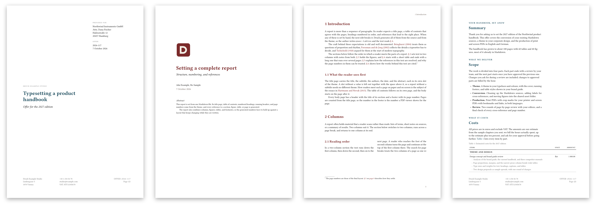
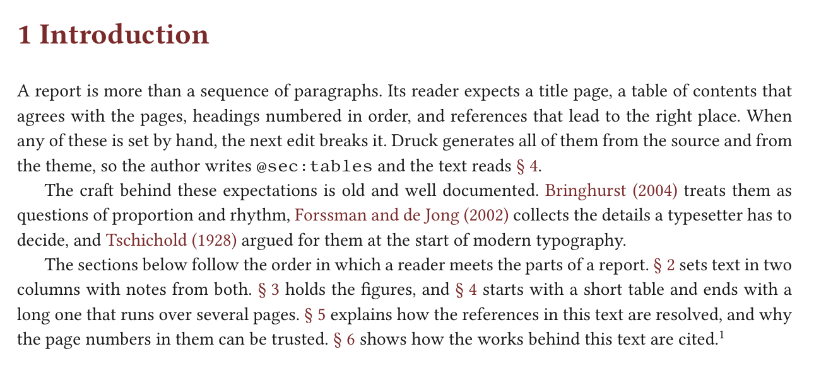

<h1 align="center">Druck</h1>

<p align="center"><strong>A typesetter for beautiful Markdown documents.</strong></p>

<p align="center">
  <a href="https://github.com/coderscantina/druck/releases/latest"></a>
  <a href="https://github.com/coderscantina/druck/actions/workflows/ci.yml"></a>
  <a href="LICENSE"></a>
</p>

<p align="center"></p>

Druck turns a Markdown file into a PDF that looks set by hand. It breaks each paragraph as a whole, the way TeX does, and places page breaks by weighing the whole document. Footnotes, columns, tables, figures, and citations land where a careful typesetter would put them.

It is one binary. Fonts and hyphenation patterns are built in, and it never touches the network. The same input gives the same layout on macOS, Linux, and Windows, and CI compares the PDFs on every push.

<p align="center"></p>

## What it sets

- **Paragraphs** broken with total-fit optimization, English and German hyphenation, hanging punctuation, and ligatures.
- **Pages** with scored breaks: no stranded lines, headings kept with their text, and keep groups that start a fresh page when needed.
- **Footnotes** that continue across pages, also from two-column sections.
- **Columns** that start and end mid-page, balanced, with full-width blocks in between.
- **Images and figures** in PNG, JPEG, and SVG, with numbered captions.
- **Tables** that run over many pages with repeated headers, plus list tables with paragraphs, lists, and spanning cells inside.
- **Reports** with title pages, a table of contents, numbered headings, running headers, and cross-references to sections, figures, tables, and pages.
- **Citations** from a BibTeX file in author-date or numeric style, with a linked bibliography.
- **Business documents** with covers, address blocks, and three-column footers, set in your own installed fonts.
- **Placeholders** for word counts, reading time, and the build date, and a draft watermark.

It is fast. A 93-page document full of tables renders in 0.3 seconds on an Apple M1 Pro.

## Install

Download the archive for your platform from [the latest release](https://github.com/coderscantina/druck/releases/latest), unpack it, and put `druck` on your `PATH`. Builds exist for macOS (Apple silicon and Intel), Linux (x86-64 and arm64), and Windows (x86-64).

The binaries are not signed yet. On macOS, clear the quarantine flag once with `xattr -d com.apple.quarantine druck`.

To build from source, install Rust and run:

```sh
cargo install --locked --git https://github.com/coderscantina/druck
```

## Quick start

Write a document with a little front matter:

```markdown
---
title: Field notes
author: Ada Example
toc: true
bibliography: references.bib
---

# Introduction {#sec:intro}

Good spacing goes unnoticed [@bringhurst2004, p. 25]. @sec:method explains how we measured it.[^1]

[^1]: Footnotes break across pages when they have to.

# Method {#sec:method}

We counted the gaps.
```

Then render it:

```sh
druck render notes.md                 # writes notes.pdf next to the source
druck render notes.md --theme brand.json -o out/notes.pdf
druck check notes.md                  # lays it out and reports every problem, writes nothing
```

Front matter covers metadata and a few design settings. `--set` overrides any of them from the command line, for example `--set toc=false` or `--set margins.top=2cm`.

## Make it yours

The design lives in a JSON theme: page size and margins, fonts, type sizes, colors, title pages, headers and footers, table rules, and custom styles you apply with `{.name}`. A theme only has to state what differs from [the default](themes/default.json), and [the schema](schema/theme.v1.schema.json) gives your editor completion and checks.

The [samples](samples) show what a theme can do. Render them all with `scripts/render-samples.sh <druck> <outdir>`.

## Documentation

- [Authoring](docs/AUTHORING.md): front matter, the command line, Markdown, directives, references, and citations.
- [Themes](docs/THEMES.md): the theme format, section by section.
- [Releasing](docs/RELEASE.md): building, checking, and publishing a release.

Development notes: [the product briefing](docs/BRIEFING.md), [milestones](docs/PHASE_1_MILESTONES.md), [progress](docs/PROGRESS.md), [decisions](docs/DECISIONS.md), and [the planned public crate](docs/RUST_CRATE_API_PHASE_2.md).

## License

Druck is released under the [MIT license](LICENSE), © 2026 Michael Wallner, [Coders Cantina](https://coderscantina.com).

Release binaries bundle the Libertinus fonts (SIL Open Font License), hyphenation patterns, and Rust crates under their own licenses. They are listed in [the notices](THIRD_PARTY_NOTICES.md).
