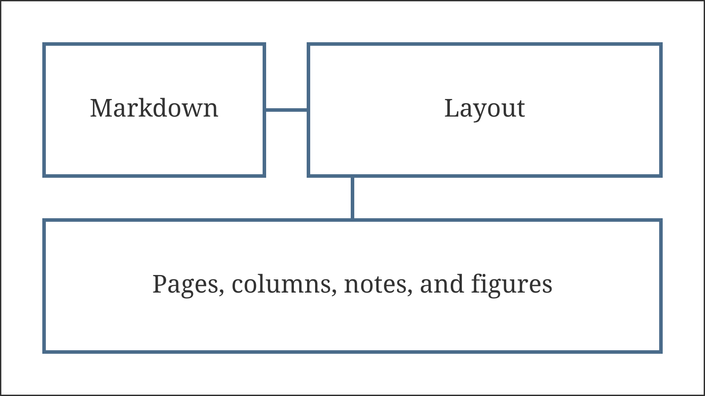
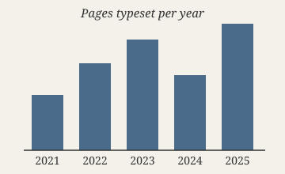
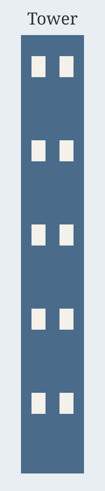

An image stands alone in its paragraph. Its description becomes the caption, numbered with the label of the document language, and the two stay together on one page and in one column. Images keep their place in the text: there are no floats, so an image appears exactly where the source puts it, and the text after it continues below its caption.

The image above is a PNG of 240 by 150 pixels. Druck counts one pixel as one point, so it appears at its natural size of 240 by 150 points, centered in the text area. An image is never enlarged beyond its natural size; a small image stays small rather than turning blurred.[^raster]

[^raster]: A note shares the page with the images around its reference. Its height counts when the search decides whether an image still fits.

A page break may not fall between an image and its caption. When the image and its caption do not fit in the room left on a page, both move to the next page, and the page they leave ends short. The search for page breaks weighs that short page against the alternatives, so it may also move a paragraph or two to fill the gap differently. The following paragraphs lead up to such a case near the foot of the page.

Typesetting has always been a negotiation between the content and the page. A paragraph can bend: its lines can break in many places, its spaces can stretch, and a page can end between any two of its lines. An image cannot bend at all. It is one rigid box, and the page has to make room for it or pass it on.

That rigidity is why traditional systems let figures float to the top or bottom of a page, or to the next page, away from the text that refers to them. Druck keeps images in document order instead. The reader finds each figure where the author placed it, at the cost of an occasional short page.

The drawing above is an SVG of 1600 by 900 pixels, which is 1200 by 675 points, far wider than the text area. It is scaled down proportionally until it fits the width. Its text uses the bundled fonts, so it looks the same on every machine.

# Images in columns

Inside a column section an image takes the width of its column. An image that is wider is scaled down to fit, and a narrower one is centered in the column. When an image and its caption do not fit in the rest of a column, they move to the top of the next column, or to the next page.

::: columns
Two columns hold the short notes of a field report. Each note is a paragraph or two, with an image where the observation needs one. The first column fills with text before the first image arrives, so the image starts lower down.

The chart is 270 points wide at its natural size, wider than a column, so it is scaled to the column width. Its labels shrink with it, since an SVG scales as a whole.[^chart]

[^chart]: Labels inside an SVG are part of the drawing. They do not take the caption style and are not hyphenated.

The second image is a JPEG photograph in portrait format. It is taller than it is wide, so at the column width it still needs a good part of the column height.

A column section balances its last columns as before. An image counts as one tall line that cannot be split, so balancing places the column break before or after an image and its caption, never inside them.

::: full-width

:::

Below a full-width block the columns resume. The image in the block above spans the text area rather than a column, because the block asks for the full width explicitly. Druck never promotes an image to the full width on its own.

A very tall image follows. At the column width it would be taller than the page, so it is scaled down further until it and its caption fit the height of a column.

The tall image fills most of a column. The text after it continues in the other column or on the next page, wherever the search for breaks finds the best place.[^tall]

[^tall]: The height an image may take leaves room for its caption, and for a heading directly above it, since a heading never ends a page.

Short notes close the section. Each column ends at about the same height, and the paragraph after the section returns to the full width.
:::

The paragraph after the column section runs across the full text area again. Images and captions follow the same page rules as text everywhere: a heading stays with the image after it, a keep group may hold an image, and notes referenced beside an image share the note area of its page.
